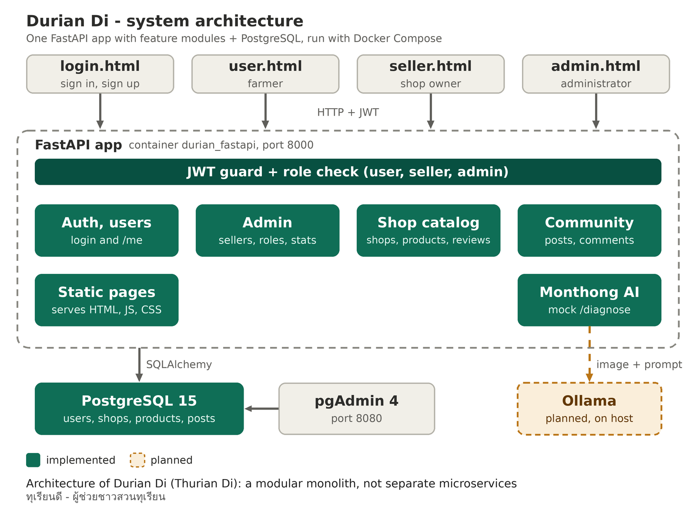
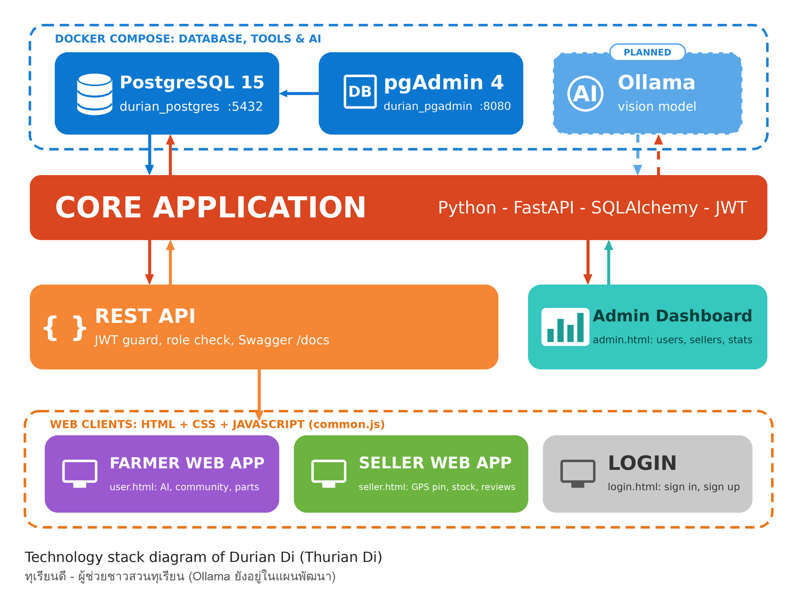

# 🌿 ทุเรียนดี - AI & Community Platform สำหรับชาวสวนทุเรียน

> โปรเจกต์ Full-Stack พัฒนาเว็บแอปพลิเคชันผู้ช่วยชาวสวนทุเรียน ที่รวมผู้ช่วย AI "หมอนทอง" ร้านอะไหล่และเครื่องมือเกษตร และชุมชนรีวิวไว้ในที่เดียว สร้างด้วย FastAPI และ PostgreSQL มีระบบสิทธิ์ 3 ระดับ (ผู้ใช้ / ผู้ขาย / แอดมิน) และรันทั้งระบบได้ด้วยคำสั่งเดียวผ่าน Docker Compose

---

## 🎯 งานของเราคืองานอะไร? (Project Overview & Core Scope)
**ทุเรียนดี** ไม่ใช่เว็บบอร์ดทั่วไป แต่เป็นแพลตฟอร์มที่ออกแบบมาเพื่อแก้ปัญหาของชาวสวนมือใหม่ที่เจออุปกรณ์สวนเสียแล้วหาสาเหตุไม่ได้ ไม่รู้ว่าอะไหล่ชิ้นไหนคืออะไร และไม่กล้าไว้ใจราคาที่ช่างบอก งานของเราครอบคลุม 3 ส่วนหลัก:

1. **Role-Based Frontend (หน้าบ้านแยกตามสิทธิ์):**
   - บังคับล็อกอินก่อนเข้าเว็บทุกครั้ง หลังล็อกอินระบบจะส่งผู้ใช้ไปยังหน้าของสิทธิ์ตัวเองอัตโนมัติ
   - **ผู้ใช้ทั่วไป** (`user.html`): หมอนทอง AI, ชุมชนและรีวิว, เทียบอะไหล่เกษตร, แดชบอร์ดสวน, แบ่งปันข้อมูล
   - **ผู้ขาย** (`seller.html`): ปักหมุดตำแหน่งร้านด้วย GPS, เพิ่ม/แก้/ลบสินค้าและสต๊อก, ดูรีวิวสินค้าของร้านตัวเอง
   - **แอดมิน** (`admin.html`): สร้างบัญชีผู้ขาย, เปลี่ยนสิทธิ์ผู้ใช้, ค้นหาผู้ใช้, ดูภาพรวมระบบ (จำนวนผู้ใช้ ผู้ขาย ร้านค้า สินค้า)
   - ทุกหน้าตรวจสิทธิ์กับเซิร์ฟเวอร์ผ่าน `/me` ตอนโหลด ไม่เชื่อค่าที่เก็บในเครื่องอย่างเดียว

2. **Robust Backend REST API (หลังบ้าน):**
   - พัฒนาด้วย **FastAPI** พร้อม **Pydantic** ตรวจสอบความถูกต้องของข้อมูลตั้งแต่วินาทีแรกที่ส่งเข้ามา
   - ยืนยันตัวตนด้วย **JWT** ที่มีรหัส `jti` และตาราง `revoked_tokens` ทำให้ `/logout` ยกเลิก token ฝั่งเซิร์ฟเวอร์ได้จริง ไม่ใช่แค่ลบจากเบราว์เซอร์
   - ควบคุมสิทธิ์ด้วย `require_role()` ทุก endpoint ที่ต้องจำกัดสิทธิ์ และ endpoint ข้อมูลทั้งหมดต้องล็อกอินก่อนเรียก
   - มี **10 endpoint หลัก** ตามโจทย์ Authentication / User Management และ endpoint เสริมสำหรับแอดมิน ร้านค้า สินค้า รีวิว ชุมชน และหมอนทอง AI

3. **Containerized Architecture & Orchestration (ระบบจัดเก็บและจำลองสภาพแวดล้อม):**
   - ฐานข้อมูล **PostgreSQL 15** เก็บข้อมูลผู้ใช้ ร้านค้า สินค้า รีวิว โพสต์ คอมเมนต์ และ token ที่ถูกยกเลิก
   - ห่อหุ้มแอปด้วย **Dockerfile** และควบคุม PostgreSQL, FastAPI และ pgAdmin ให้ทำงานร่วมกันผ่าน **Docker Compose** รันได้เหมือนกันทุกเครื่องด้วยคำสั่งเดียว

---

## 💡 ทำไมถึงต้องทำโปรเจกต์นี้? (Motivation & Objective)
* **แก้ปัญหาจริงของชาวสวนมือใหม่:** เมื่ออุปกรณ์อย่างปั๊มน้ำ เครื่องพ่นยา หรือเครื่องตัดหญ้าเสีย มือใหม่มักหาสาเหตุเองไม่ได้ ต้องพึ่งช่างและกลัวถูกเอาเปรียบ อีกทั้งยังหาอะไหล่ที่ตรงรุ่นและเปรียบเทียบราคาได้ยาก
* **รวมข้อมูลที่กระจัดกระจายไว้ในที่เดียว:** แทนที่จะถามต่อ ๆ กันในกลุ่มออนไลน์ ผู้ใช้สามารถแจ้งปัญหากับผู้ช่วย AI ดูร้านอะไหล่ใกล้ตัว และอ่านรีวิวจากผู้ใช้จริงก่อนตัดสินใจซื้อได้ในเว็บเดียว
* **ยกระดับจากเว็บ CRUD พื้นฐาน:** ผนวกระบบสิทธิ์หลายระดับ การยกเลิก token ฝั่งเซิร์ฟเวอร์ ข้อมูลพิกัดร้านค้า และผู้ช่วย AI เข้ากับฐานข้อมูลจริง เพื่อให้ใกล้เคียงระบบที่ใช้งานได้จริงมากที่สุด

---

## ⚖️ ทำไมถึงแตกต่าง? (Key Differentiators & Technical Choices)
* **ระบบสิทธิ์ 3 ระดับที่กันทั้งหน้าเว็บและ API:** นอกจากหน้าเว็บจะส่งผู้ใช้ไปหน้าของสิทธิ์ตัวเองแล้ว backend ยังตรวจสิทธิ์ซ้ำทุกครั้ง ผู้ขายสมัครเองไม่ได้ ต้องให้แอดมินสร้างบัญชีให้ และแอดมินคนแรกสร้างผ่านสคริปต์ `seed_admin.py`
* **Logout ที่ยกเลิก token จริง:** ใช้ `jti` และตาราง `revoked_tokens` ทำให้ token ที่ออกจากระบบแล้วใช้ต่อไม่ได้อีก
* **ร้านค้าพร้อมพิกัดและสต๊อก:** ผู้ขายปักหมุดร้านและจัดการจำนวนสินค้าเอง ผู้ใช้ดูรีวิวสินค้าได้ ซึ่งเป็นฐานสำหรับฟีเจอร์ค้นหาร้านอะไหล่ที่ใกล้ที่สุดในอนาคต
* **ป้องกัน XSS ในหน้าแอดมินและผู้ขาย:** ข้อมูลที่ผู้ใช้กรอก (ชื่อผู้ใช้ อีเมล ชื่อสินค้า คอมเมนต์รีวิว) ถูก escape ก่อนแสดงผลทุกจุด
* **รันได้เหมือนกันทุกเครื่อง:** Docker Compose ทำให้ API ฐานข้อมูล และ pgAdmin คุยกันผ่านชื่อ service โดยไม่ต้องตั้งค่า IP และไม่ชนกับไลบรารีในเครื่อง

---

## 🛠️ Tech Stack รายละเอียด
* **Frontend:** HTML5, CSS, JavaScript (Vanilla), Chart.js, Google Fonts
* **Backend API:** Python, FastAPI, Pydantic, SQLAlchemy, Psycopg2
* **Authentication:** JWT (python-jose), bcrypt (passlib)
* **Database:** PostgreSQL 15
* **Infrastructure & DevOps:** Docker, Docker Compose, pgAdmin 4
* **AI (แผนพัฒนา):** Ollama (โมเดลภาพ vision รันในเครื่อง)

---

## 📂 Project Architecture Structure

```
ThurianDi/
├── main.py                  # FastAPI รวมทุก endpoint, โมเดลฐานข้อมูล, ระบบ JWT และสิทธิ์
├── seed_admin.py            # สคริปต์สร้างบัญชีแอดมินคนแรก
├── requirements.txt         # Dependencies (FastAPI, SQLAlchemy, Psycopg2, python-jose, ...)
├── Dockerfile               # สร้าง image ของ FastAPI App
├── docker-compose.yml       # PostgreSQL + FastAPI + pgAdmin
├── init-postgres.sql        # Schema ที่ Docker ใช้ตอนสร้างฐานข้อมูล
├── init.sql                 # Schema เวอร์ชัน MySQL สำหรับ import ใน phpMyAdmin (ไม่ได้ใช้กับ Docker)
├── .env                     # ค่าตั้งต้น เช่น SECRET_KEY, รหัสผ่านฐานข้อมูล
├── login.html               # หน้าเข้าสู่ระบบและสมัครสมาชิก (ทางเข้าเดียวของเว็บ)
├── user.html                # หน้าผู้ใช้ทั่วไป
├── seller.html              # หน้าผู้ขาย
├── admin.html               # หน้าแอดมิน
├── common.js                # ฟังก์ชันที่ใช้ร่วมกัน: token, api(), requireAuth(), logout(), esc()
├── app.js                   # โค้ดของหน้าผู้ใช้ทั่วไป
└── style.css                # สไตล์ที่ใช้ร่วมกัน
```

---

## 🚀 วิธีการติดตั้งและรันระบบ (Quick Start)

1. **ตรวจสอบความพร้อม:** ติดตั้ง Docker Desktop และเปิดใช้งานให้ขึ้นสถานะ *Engine running* ก่อน (รองรับ Windows WSL2, macOS และ Linux)

2. **เตรียมไฟล์ตั้งค่า:** ตรวจว่ามีไฟล์ `.env` ในโฟลเดอร์โปรเจกต์ และ **เปลี่ยน `SECRET_KEY` ก่อนใช้งานจริงทุกครั้ง**

3. **สั่งประกอบและรันระบบทั้งหมด:**

```
docker compose up --build
```

4. **สร้างบัญชีแอดมินคนแรก** (ทำครั้งเดียว ตอน container `durian_fastapi` กำลังทำงานอยู่):

```
docker exec -it -e ADMIN_USERNAME=admin -e ADMIN_EMAIL=admin@example.com -e ADMIN_PASSWORD=yourpassword123 durian_fastapi python seed_admin.py
```

5. **เข้าใช้งานระบบผ่านเบราว์เซอร์:**
   - หน้าเว็บหลัก (เข้าสู่ระบบ): http://localhost:8000
   - เอกสาร API อัตโนมัติ (Swagger UI): http://localhost:8000/docs
   - จัดการฐานข้อมูลผ่าน pgAdmin: http://localhost:8080
   - ตรวจสถานะระบบ: http://localhost:8000/api/health

6. **ลองใช้งานตามสิทธิ์:**
   - สมัครสมาชิกจากหน้าแรก จะได้สิทธิ์ผู้ใช้ทั่วไปและเข้า `user.html`
   - ล็อกอินด้วยแอดมินแล้วสร้างบัญชีผู้ขายจากหน้า `admin.html`
   - ล็อกอินด้วยผู้ขายเพื่อเข้า `seller.html` ปักหมุดร้านและลงสินค้า

---

## 📡 สรุปรายการ API Endpoints ที่รองรับ

**Authentication**
- `POST /register`, `POST /login`, `POST /logout`, `POST /change-password`

**User Management**
- `GET /me`, `GET /users/{id}`, `GET /users` (รองรับ Pagination), `PUT /users/{id}`, `DELETE /users/{id}`, `GET /check-username/{name}`

**Admin** (เฉพาะสิทธิ์แอดมิน)
- `POST /admin/sellers`, `PATCH /admin/users/{id}/role`, `GET /admin/stats`

**Shops & Products**
- `GET /shops`, `GET /shops/mine`, `PUT /shops/mine`
- `GET /products`, `GET /products/mine`, `POST /products`, `PUT /products/{id}`, `DELETE /products/{id}`
- `GET /products/{id}/reviews`, `POST /products/{id}/reviews`

**Community**
- `GET /posts`, `POST /posts`, `DELETE /posts/{id}`, `GET /posts/{id}/comments`, `POST /posts/{id}/comments`

**หมอนทอง AI**
- `POST /diagnose` (รับรูป JPG / PNG / WEBP ไม่เกิน 10MB)

> ทุก endpoint ยกเว้น `/register`, `/login`, `/check-username/{name}` และ `/api/health` ต้องแนบ JWT ในรูปแบบ `Authorization: Bearer <token>`

---

## 🧭 สถานะการพัฒนา (Project Status)

**ทำเสร็จแล้ว**
- ระบบสมาชิก 3 สิทธิ์ พร้อมล็อกอิน ออกจากระบบ และเปลี่ยนรหัสผ่าน
- หน้าผู้ขาย: ปักหมุดร้าน จัดการสินค้าและสต๊อก ดูรีวิว
- หน้าแอดมิน: สร้างผู้ขาย จัดการสิทธิ์ ดูภาพรวมระบบ
- ระบบชุมชน (โพสต์และคอมเมนต์) และรีวิวสินค้า

**กำลังพัฒนา / แผนต่อไป**
- เชื่อมหมอนทอง AI กับ Ollama (โมเดลที่อ่านรูปได้) ตอนนี้ `/diagnose` ยังตอบเป็นผลจำลอง
- รูปโปรไฟล์ตอนสมัครสมาชิก และชื่อ/สิทธิ์ที่แสดงในหน้าผู้ใช้
- ประวัติการแจ้งปัญหาแบบแชท เปิดดูย้อนหลังได้
- ส่วนเทียบอะไหล่ ร้านค้า และแดชบอร์ดในหน้าผู้ใช้ ยังเป็นข้อมูลตัวอย่าง รอเชื่อมข้อมูลจริง
- ค้นหาร้านอะไหล่ที่ใกล้ที่สุดและแนะนำอะไหล่ทดแทน

---

## 👥 สมาชิก
1. 67160158 - นายชินภัทร เบลเลอร์


---

## 🖼️ ภาพประกอบ
> ใส่ภาพหน้าจอของระบบ และแผนภาพสถาปัตยกรรมที่นี่ เช่น







